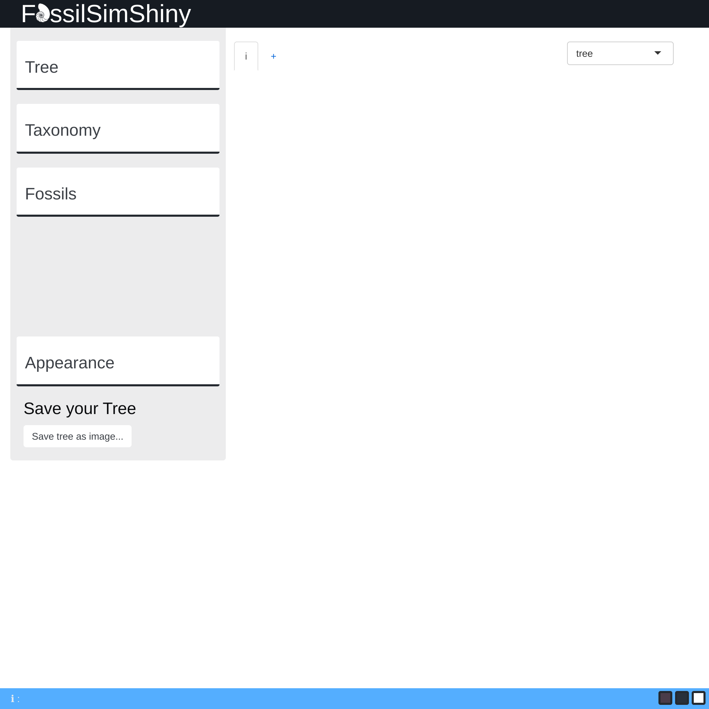
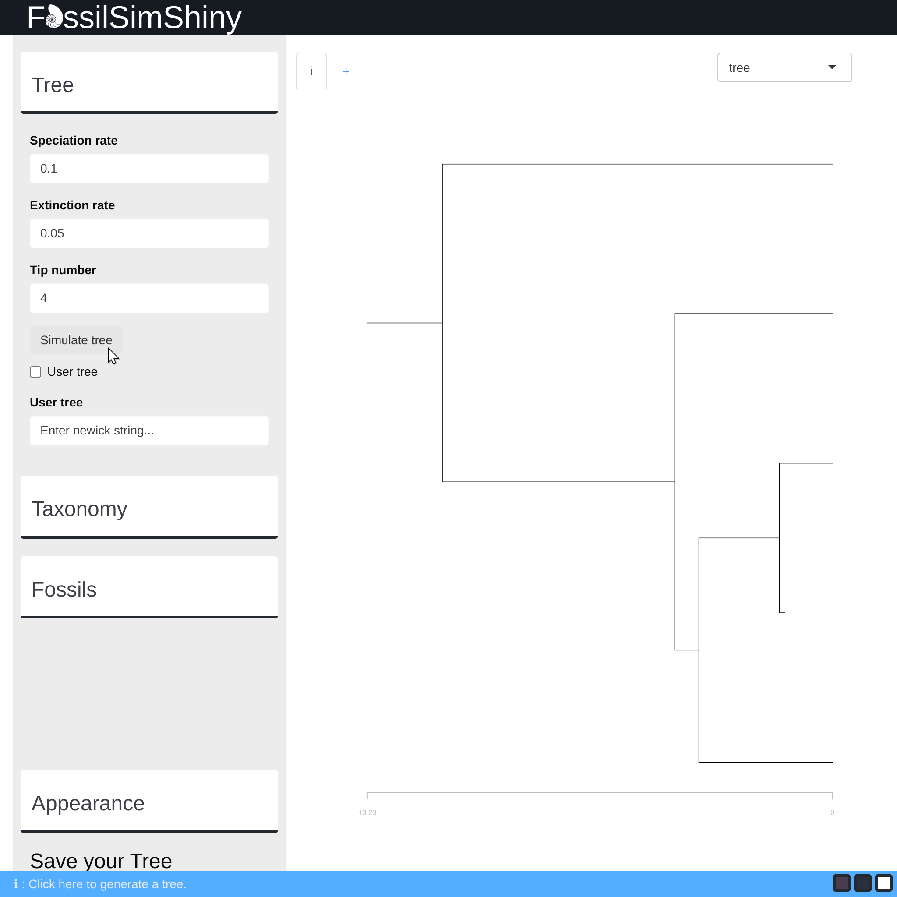
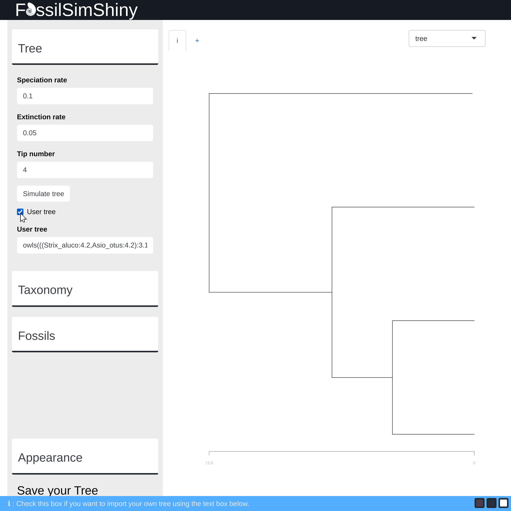
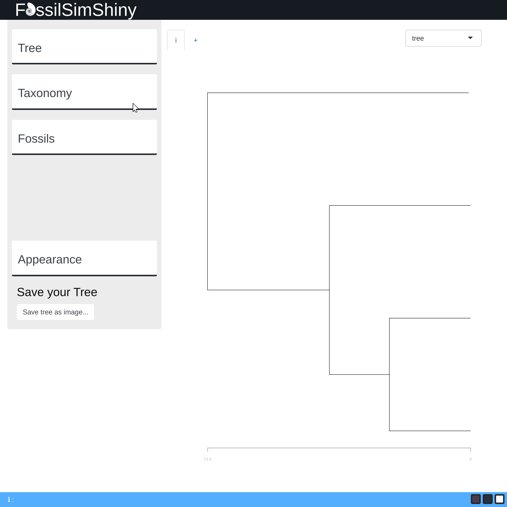
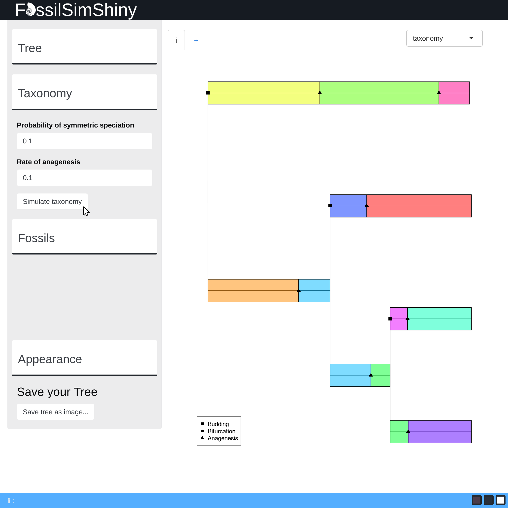
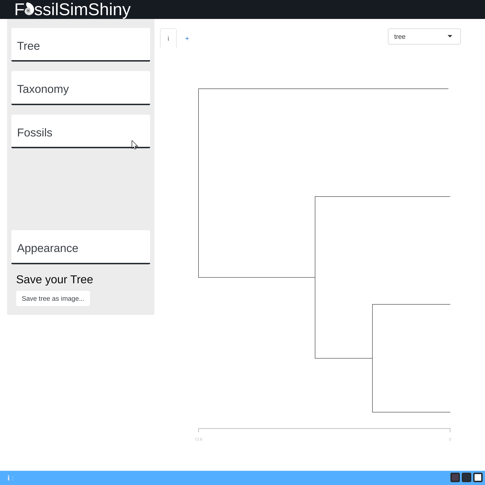
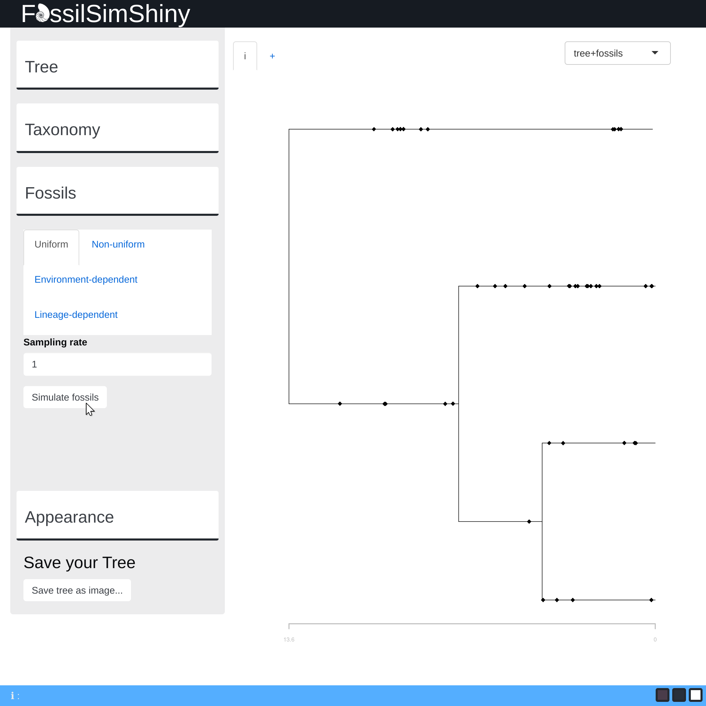
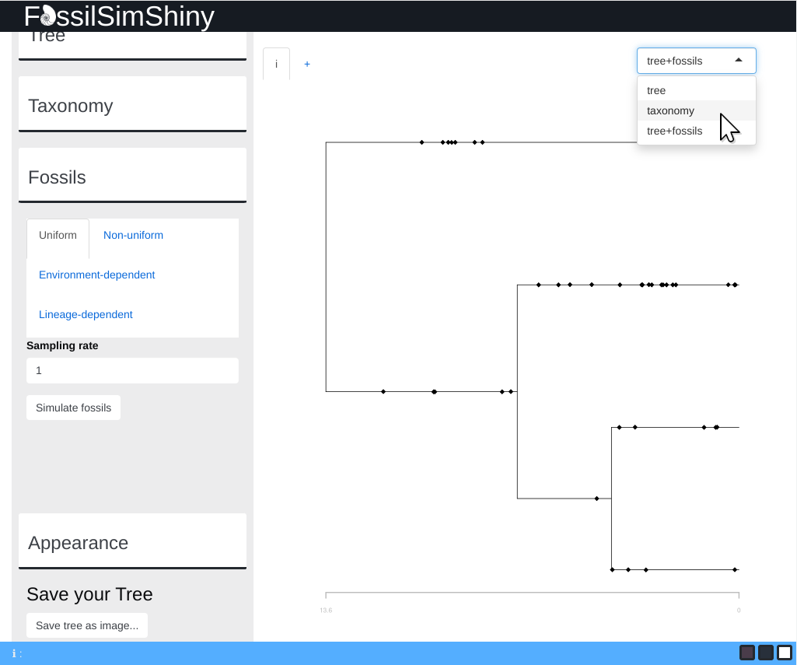
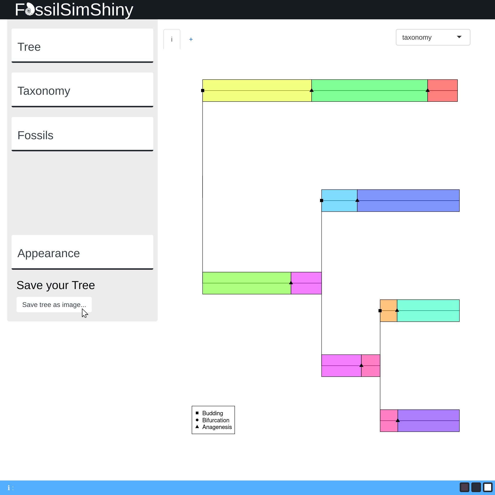

```{r, include = FALSE}
knitr::opts_chunk$set(
  collapse = TRUE,
  comment = "#>"
)
```

This vignette provides information on how to use the `FossilSimShiny` application to perform simple tasks.

## Contents

* [Launching the app]
* [Phylogenetic Tree]
  * [Generating a Tree]
  * [Importing a tree from Newick format]
* [Generating Taxonomy]
* [Simulating Fossils]
* [Saving your tree as a `.png`]
* [Last Words]
* [Additional Information]

## Launching the app

Let's dive right in.\
\
Once you have installed the `FossilSimShiny` package,\
\
```{r, eval=FALSE}
install.packages("FossilSimShiny")
```
\
Simply use the command:\

```{r, eval=FALSE}
FossiSimShiny::launchFossilSimShiny()
```
\
This should launch the application in your preferred browser.\
\
If you are using `RStudio` and you want to launch the app inside `RStudio's` browser, you can instead use:\

```{r, eval=FALSE}
FossiSimShiny::launchFossilSimShiny(FALSE)
```
\
```{r echo=FALSE, out.width = "90%", fig.cap = cap}

cap = "**Fig. 1**. FossilSimShiny main screen."
```

## Phylogenetic Tree

### Generating a tree

To generate a tree, start by opening the tree tab by clicking on the **tree** tab.\
\
```{r echo=FALSE, out.width = "90%", fig.cap = cap}

cap = "**Fig. 2**. Clicking the tree tab."
```
\
A new menu should appear. Inside this menu, you can set different tree parameters:\

* Specialization rate

* Extinction rate

* Tip number

Once you are happy with the parameters you have set, press the **simulate tree** button to generate a tree.\
\
```{r echo=FALSE, out.width = "90%", fig.cap = cap}

cap = "**Fig. 3**. Generating a tree from set parameters."
```

### Importing a tree from Newick format

To use your own trees, simply tick the user tree check box and paste your `Newick` string inside the designated text box below.\
\
```{r echo=FALSE, out.width = "90%", fig.cap = cap}

cap = "**Fig. 4**. Importing a premade tree.</br>Newick string used: `owls(((Strix_aluco:4.2,Asio_otus:4.2):3.1, Athene_noctua:7.3):6.3,Tyto_alba:13.5);`."
```
\
Since the app uses the `ape::read.tree()` function from the `ape` package. Look 
<a href = "https://www.rdocumentation.org/packages/ape/versions/5.6-2/topics/read.tree">here</a> 
for more information on how to format your trees.

## Generating Taxonomy

**Once you have a phylogenetic tree,** you can generate it's taxonomy.\

*Note: if do not have a tree generated, go back to [Phylogenetic Tree].*\
\
Open the taxonomy menu by clicking on the **taxonomy** tab.\
\
```{r echo=FALSE, out.width = "90%", fig.cap = cap}

cap = "**Fig. 5**. Clicking the taxonomy tab."
```
\
Inside you can set different parameters:\

* Probability of symmetric speciation 

* Rate of anagenesis

When everything is set, press the **simulate taxonomy** button.\
\
```{r echo=FALSE, out.width = "90%", fig.cap = cap}

cap = "**Fig. 6**. Simulating a taxonomy with the default parameters."
```

## Simulating Fossils

**Once you have a phylogenetic tree,** you can immediately simulate fossil records.\

*Note: if do not have a tree generated, go back to [Phylogenetic Tree]. Furthermore, if you wish to use a lineage-dependent model to simulate your fossils, it is recommended to generate the taxonomy first. Go to [Generating Taxonomy].*\
\
First, click on the **fossils** tab.\
\
```{r echo=FALSE, out.width = "90%", fig.cap = cap}

cap = "**Fig. 7**. Clicking the fossils tab."
```
\
In the fossils tab, you must choose which model you would like to use to simulate your fossil records. Each one of them has their own peculiarities:\

* Uniform
* Non-uniform
* Environment-dependent
* Lineage-dependent

\
```{r echo=FALSE, out.width = "90%", fig.cap = cap}

cap = "**Fig. 8**. Generating fossil records for our tree using a uniform distribution."
```

## Saving your tree as a `.png`

Use the **drop down** in the top left corner of the app to select the plot that you would like to save.\
As an example, let's save a picture of our taxonomy.\
\
```{r echo=FALSE, out.width = "90%", fig.cap = cap}

cap = "**Fig. 9**. Going back to the taxonomy view to save it as an image."
```
\
Then, just press the **save tree as image...** button.\
\
```{r echo=FALSE, out.width = "90%", fig.cap = cap}

cap = "**Fig. 10**. Saving our taxonomy as an image."
```
\
Your plot should get saved as a `.png` to your `/downloads` folder.\

## Last words

And voilà ! You know all the basics and can now generate your own trees, taxonomy and fossil records.\
If you would like to dive a bit deeper into more advanced functionalities check out (COMING SOON).\

## Additional information
All screenshots in this guide were taken on the **Google Chrome** browser using the built in `screenshot` command.\
\
**Dimensions:** 1024x1024 75%, **Output:** 2048x2048, **Resized to:** 2048x2048.\
